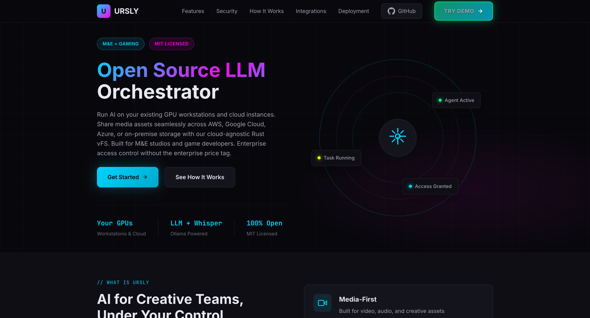

<div align="center">


# Ursly

### One App. All Your Files.

**Stop juggling different apps for your cloud storage.<br>Connect Dropbox, Google Drive, AWS, Azure, your NAS, and more — browse everything from one beautiful interface.**

<br />


<br />
<br />

<!-- Primary Badges -->

[](https://www.gnu.org/licenses/agpl-3.0)
[](https://github.com/stonyp90/Ursly/stargazers)

<br />

[**Download**](https://github.com/stonyp90/Ursly/releases/latest) · [Website](https://ursly.io) · [Documentation](./agents.md) · [Report Bug](https://github.com/stonyp90/Ursly/issues/new) · [Request Feature](https://github.com/stonyp90/Ursly/issues/new)

</div>

---

## The Problem

Your files are everywhere. Project files on your NAS. Archives in the cloud. Renders on your local drive. Different apps for each. Wasted time hunting for files.

**Ursly brings it all together.** One app that connects to all your storage. See everything in one place. Move files between any location with drag & drop. Find anything instantly with AI-powered search.

---

## Download

Free for personal use. No account required.

| Platform    | Download                                                                                            | Requirements                      |
| ----------- | --------------------------------------------------------------------------------------------------- | --------------------------------- |
| **macOS**   | [Download .dmg](https://github.com/stonyp90/Ursly/releases/latest/download/ursly-vfs.dmg)           | macOS 11+ (Apple Silicon & Intel) |
| **Windows** | [Download .msi](https://github.com/stonyp90/Ursly/releases/latest/download/ursly-vfs.msi)           | Windows 10/11                     |
| **Linux**   | [Download .AppImage](https://github.com/stonyp90/Ursly/releases/latest/download/ursly-vfs.AppImage) | glibc 2.31+                       |

> **macOS users:** If you see "App is damaged", run this in Terminal: `xattr -cr /Applications/Ursly\ VFS.app`

---

## Features

| Feature                 | Description                                                                |
| ----------------------- | -------------------------------------------------------------------------- |
| **15+ Connections**     | Dropbox, Google Drive, AWS S3, Azure, NAS, SFTP, WebDAV, and more          |
| **AI-Powered Search**   | Find files by what's in them, not just their names                         |
| **Video Transcription** | Automatically transcribe videos and search by what was said (99 languages) |
| **Move Files Anywhere** | Drag and drop files between any storage — cloud to cloud, cloud to local   |
| **Smart Tagging**       | Automatically tag photos and images with AI                                |
| **Keyboard Shortcuts**  | Work faster with keyboard shortcuts for everything                         |
| **System Monitor**      | See GPU, CPU, RAM, and network usage at a glance                           |
| **Private AI**          | AI runs locally on your machine — your files never leave your computer     |

---

## Storage Connections

Works with the storage you already use:

| Cloud Storage        | Network & Local                | Enterprise                    |
| -------------------- | ------------------------------ | ----------------------------- |
| AWS S3               | Network Attached Storage (NAS) | AWS FSx for ONTAP             |
| Google Cloud Storage | SMB/CIFS Shares                | Azure Blob (Hot/Cool/Archive) |
| Azure Blob Storage   | NFS Mounts                     | Backblaze B2                  |
| Dropbox              | SFTP Servers                   | Wasabi                        |
| Google Drive         | WebDAV                         | MinIO                         |
| OneDrive             | Local Drives                   | DigitalOcean Spaces           |

_...and more coming soon!_

---

## Screenshots

<p align="center">
  
</p>

<p align="center"><em>System monitor — keep an eye on your GPU, CPU, RAM, and network</em></p>

<p align="center">
  
</p>

<p align="center"><em>Keyboard shortcuts — work faster without reaching for your mouse</em></p>

---

## Getting Started

### Download (Recommended)

1. Download from [Releases](https://github.com/stonyp90/Ursly/releases/latest)
2. Install and launch
3. Add your storage sources
4. Start browsing!

### Build from Source (For Developers)

```bash
git clone https://github.com/stonyp90/Ursly.git
cd ursly
npm install
cd apps/vfs-desktop
npm run tauri dev
```

---

## Why Open Source?

- **Transparency** — See exactly how your files are handled
- **Privacy** — Verify that your data stays private
- **No Lock-in** — Your files, your choice, always
- **Community** — Features driven by real users

---

## Contributing

We welcome contributions!

1. Fork the repository
2. Create a feature branch: `git checkout -b feature/my-feature`
3. Make your changes with tests
4. Commit: `git commit -m 'feat: add my feature'`
5. Push: `git push origin feature/my-feature`
6. Open a Pull Request

---

## Roadmap

- [ ] Adobe Premiere Pro plugin
- [ ] DaVinci Resolve integration
- [ ] VS Code extension
- [ ] Real-time collaboration
- [ ] Team sync features

---

## License

This project is licensed under the **GNU Affero General Public License v3.0** (AGPL-3.0).

Free for personal use. See [LICENSE](LICENSE) for details.

---

<div align="center">

**[ursly.io](https://ursly.io)** &bull; [Download](https://github.com/stonyp90/Ursly/releases/latest) &bull; [Discord](https://discord.gg/cree8) &bull; [GitHub](https://github.com/stonyp90/Ursly) &bull; [LinkedIn](https://www.linkedin.com/in/anthony-paquet-94a31085/)

Created by **[Anthony Paquet](https://www.linkedin.com/in/anthony-paquet-94a31085/)**

</div>
