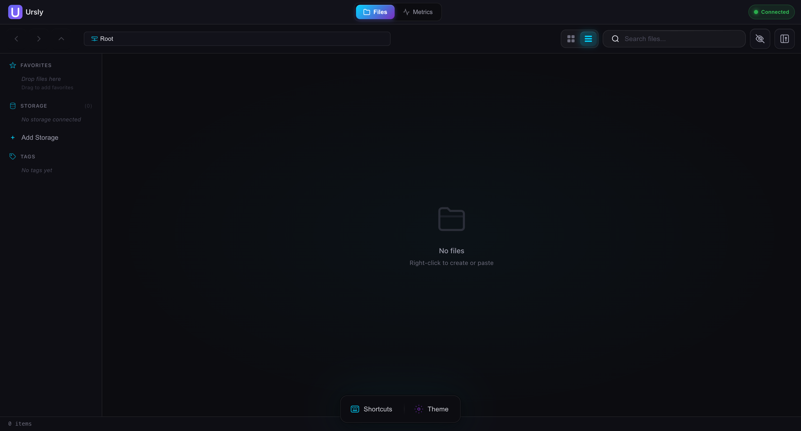

<div align="center">

# Ursly

### Agent Media Asset Management

**Unified cloud storage meets AI. One interface for all your media assets.**

[](https://ursly.io)
[](https://app.ursly.io)
[](https://www.gnu.org/licenses/agpl-3.0)
[](https://www.typescriptlang.org/)
[](https://www.rust-lang.org/)

[Website](https://ursly.io) &bull; [Live Demo](https://app.ursly.io) &bull; [Documentation](./agents.md) &bull; [Discord](https://discord.gg/cree8)

<br />



</div>

---

## What is Ursly?

Ursly is an **Agent Media Asset Management (AMAM)** platform that combines:

- **Unified Cloud Storage** &mdash; Access AWS S3, Google Cloud, Azure, NAS, and local drives through one interface
- **Open Source AI** &mdash; Run Ollama, Whisper, and LLaMA on your own hardware
- **Native Desktop App** &mdash; Built with Tauri and Rust for performance

No vendor lock-in. No per-token API costs. Your media, your infrastructure.

---

## Features

| Feature              | Description                                                        |
| -------------------- | ------------------------------------------------------------------ |
| **Multi-Cloud VFS**  | Connect S3, GCS, Azure Blob, SMB, NFS, SFTP, WebDAV, FSx for ONTAP |
| **Storage Tiering**  | Hot, warm, cold tiers with intelligent NVMe caching                |
| **AI Transcription** | Whisper-powered transcription in 99 languages                      |
| **Smart Tagging**    | AI-generated metadata with Elasticsearch search                    |
| **Media Preview**    | HLS streaming and thumbnail generation                             |
| **Theme Customizer** | Dark/light modes with 10 accent colors                             |
| **Enterprise RBAC**  | Role-based access control with Keycloak                            |
| **GPU Metrics**      | Real-time monitoring with native Rust APIs                         |

---

## Quick Start

### Docker Compose (Recommended)

```bash
# Clone the repository
git clone https://github.com/stonyp90/ursly.git
cd ursly

# Start all services
docker-compose up -d

# Open the dashboard
open http://localhost:4200
```

### Development Setup

```bash
# Install dependencies
npm install

# Start infrastructure
docker-compose up -d mongodb keycloak

# Run development servers
npm run dev
```

### Desktop App

```bash
# VFS Desktop (File Browser)
cd apps/vfs-desktop
npm run tauri dev

# Agent Desktop (AI Management)
cd apps/agent-desktop
npm run tauri dev
```

---

## Architecture

```
┌─────────────────────────────────────────────────────────────────┐
│                    Desktop Apps (Tauri + Rust)                  │
│              ┌─────────────────┬─────────────────┐              │
│              │   Ursly VFS     │  Ursly Agent    │              │
│              │  File Browser   │  AI Management  │              │
│              │  + GPU Metrics  │  + GPU Metrics  │              │
│              └─────────────────┴─────────────────┘              │
├─────────────────────────────────────────────────────────────────┤
│                     Web UI (React + MUI)                        │
├─────────────────────────────────────────────────────────────────┤
│                    API Gateway (NestJS)                         │
├──────────────┬──────────────┬───────────────────────────────────┤
│ VFS Engine   │ Audit Logger │ Entitlements (RBAC)               │
├──────────────┴──────────────┴───────────────────────────────────┤
│                  gRPC Service → Ollama                          │
├─────────────────────────────────────────────────────────────────┤
│              Keycloak (Identity) │ MongoDB (Data)               │
└─────────────────────────────────────────────────────────────────┘
```

---

## Project Structure

```
apps/
├── api/              # NestJS REST API
├── web/              # React web dashboard
├── grpc/             # Ollama gRPC bridge
├── vfs-desktop/      # Tauri file browser app
└── agent-desktop/    # Tauri AI management app

libs/
├── agent-core/       # Context window management
├── audit-logger/     # Type-safe audit logging
└── shared/
    ├── types/        # Zod schemas & shared types
    └── access-control/ # RBAC permissions engine

website/              # Landing page (ursly.io)
```

---

## Tech Stack

| Layer        | Technologies                                 |
| ------------ | -------------------------------------------- |
| **Backend**  | NestJS, TypeScript, MongoDB, gRPC, WebSocket |
| **Frontend** | React 18, MUI 6, Tailwind CSS, Vite          |
| **Desktop**  | Tauri 2.0, Rust, wgpu                        |
| **AI/ML**    | Ollama, Whisper, LLaMA 3, Mistral, Phi-3     |
| **Auth**     | Keycloak, OIDC, JWT                          |
| **Build**    | Nx Monorepo, Docker, pnpm                    |

---

## Storage Backends

| Provider                 | Status    | Features                                     |
| ------------------------ | --------- | -------------------------------------------- |
| **AWS S3**               | Supported | Transfer acceleration, versioning, lifecycle |
| **Google Cloud Storage** | Supported | Multi-region, bucket policies                |
| **Azure Blob Storage**   | Supported | Hot/cool/archive tiers                       |
| **FSx for ONTAP**        | Supported | NVMe cache, Fabric Pool tiering              |
| **SMB/CIFS**             | Supported | Windows shares, Active Directory             |
| **NFS**                  | Supported | NFSv3/v4, Unix permissions                   |
| **SFTP**                 | Supported | Key-based authentication                     |
| **WebDAV**               | Supported | HTTP-based file access                       |
| **Local**                | Supported | Direct filesystem with caching               |

---

## Service Ports

| Service  | Port  | Description       |
| -------- | ----- | ----------------- |
| Web UI   | 4200  | React dashboard   |
| API      | 3000  | REST API          |
| gRPC     | 50051 | Ollama bridge     |
| Keycloak | 8080  | Identity provider |
| MongoDB  | 27017 | Database          |
| Ollama   | 11434 | LLM inference     |

---

## Environment Variables

```bash
# .env
MONGODB_URI=mongodb://localhost:27017/ursly
KEYCLOAK_URL=http://localhost:8080
KEYCLOAK_REALM=agent-orchestrator
KEYCLOAK_CLIENT_ID=agent-api
OLLAMA_URL=http://localhost:11434
```

---

## Scripts

```bash
# Development
npm run dev              # Start all services
npm run start:web        # Web UI only
npm run start:api        # API server only
npm run start:vfs        # VFS Desktop app
npm run start:agent      # Agent Desktop app

# Testing
npm test                 # Run all tests
npm run test:e2e         # End-to-end tests
npm run lint             # Lint codebase

# Build
npm run build            # Production build
npm run build:docker     # Build Docker images
```

---

## Contributing

We welcome contributions! Please see our contribution guidelines:

1. Fork the repository
2. Create a feature branch: `git checkout -b feature/my-feature`
3. Make your changes with tests
4. Commit: `git commit -m 'feat: add my feature'`
5. Push: `git push origin feature/my-feature`
6. Open a Pull Request

### Development Guidelines

- All new code requires tests
- Follow [Conventional Commits](https://www.conventionalcommits.org/)
- Run `npm run lint` before committing
- Update documentation for new features

---

## Roadmap

- [ ] Adobe Premiere Pro UXP plugin
- [ ] DaVinci Resolve integration
- [ ] VS Code extension
- [ ] Kubernetes Helm charts
- [ ] S3 Glacier Deep Archive support
- [ ] Real-time collaboration

---

## License

This project is licensed under the **GNU Affero General Public License v3.0** (AGPL-3.0).

This ensures the software remains open source and any modifications or network deployments must also be open source. See [LICENSE](LICENSE) for details.

---

## Acknowledgments

Built with amazing open source projects:

- [Tauri](https://tauri.app/) - Desktop app framework
- [Ollama](https://ollama.ai/) - Local LLM inference
- [Whisper](https://github.com/openai/whisper) - Speech recognition
- [NestJS](https://nestjs.com/) - Backend framework
- [Keycloak](https://www.keycloak.org/) - Identity management

---

<div align="center">

**[ursly.io](https://ursly.io)**

[Website](https://ursly.io) &bull; [Demo](https://app.ursly.io) &bull; [Discord](https://discord.gg/cree8) &bull; [GitHub](https://github.com/stonyp90/ursly)

</div>
