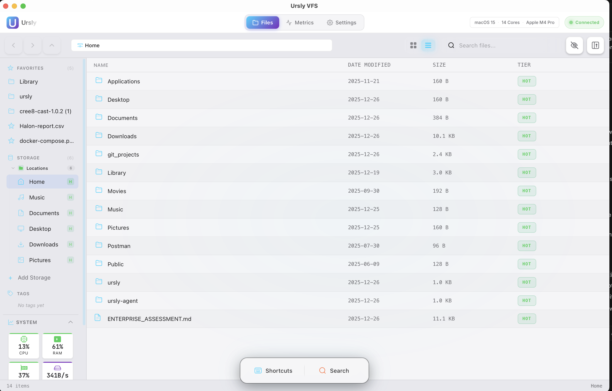
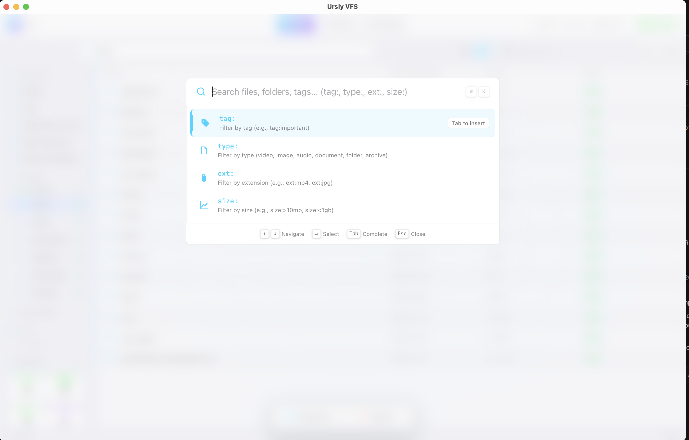
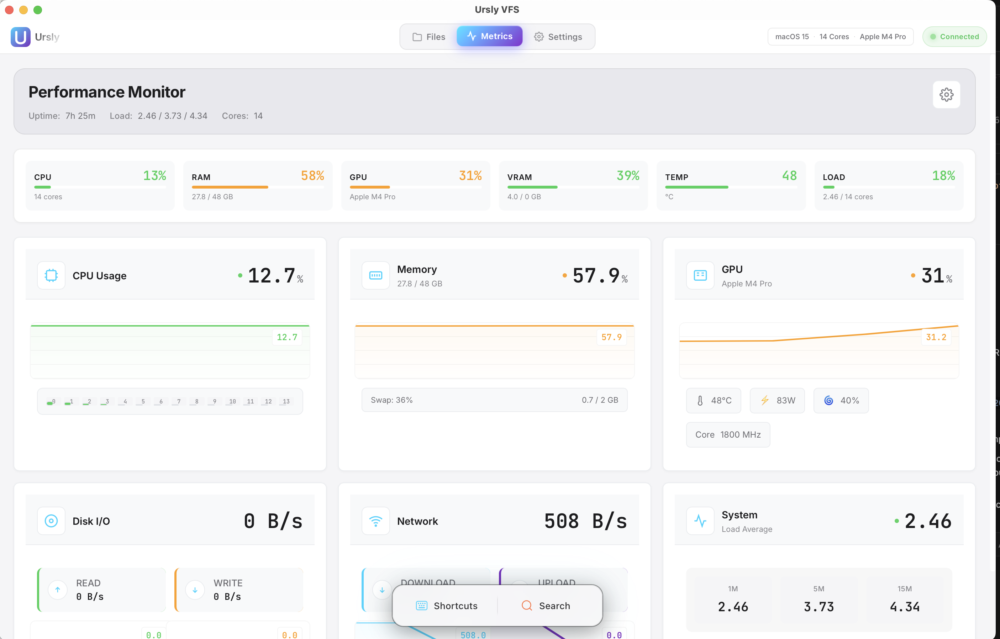
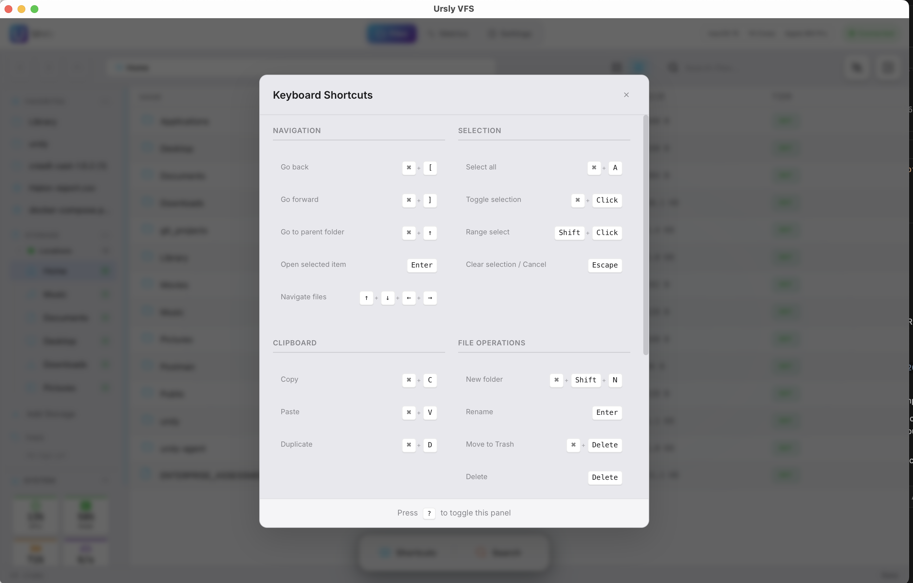

<div align="center">


# Ursly VFS

### The File Manager Built for Creatives

**One app. All your clouds. Zero friction.**

Connect AWS, Azure, Google Cloud, your NAS, and 15+ more storage services. Search instantly. Stay in flow.

<br />

### 🗂️ Your Files, One Place



_Unified file management across all your cloud storage providers in one beautiful interface_

<br />
<br />

[](https://github.com/stonyp90/Ursly/actions/workflows/ci.yml)
[](https://github.com/stonyp90/Ursly/releases/latest)
[](https://www.gnu.org/licenses/agpl-3.0)

[](https://github.com/stonyp90/Ursly/releases)
[](https://github.com/stonyp90/Ursly/releases)
[](https://github.com/stonyp90/Ursly/releases)

<br />

[**Download**](https://github.com/stonyp90/Ursly/releases/latest) · [Website](https://ursly.io) · [Report Bug](https://github.com/stonyp90/Ursly/issues/new) · [Request Feature](https://github.com/stonyp90/Ursly/issues/new)

</div>

---

## 🚀 Why Ursly VFS?

Your files are scattered across AWS S3, Azure Blob, Google Cloud, your NAS, local drives, and more. Each requires a different app. You waste hours hunting for files.

**Ursly VFS changes everything.** One beautiful, native desktop app that unifies all your storage. See everything in one place. Move files anywhere with drag & drop. Find anything instantly with Spotlight Search. Monitor system performance in real-time. All running locally with zero cloud dependencies.

---

## ✨ What You Get

### 🔗 All Your Storage in One Place

Connect **15+ storage providers** and see everything together:

- **Cloud**: AWS S3, Google Cloud Storage, Azure Blob, S3-Compatible services
- **Network**: SMB/CIFS shares, NFS mounts, SFTP servers, WebDAV
- **Hybrid**: FSx for ONTAP, NetApp
- **Block**: iSCSI targets, Fibre Channel

### 🔍 Instant Search

Press `Cmd+K` (Mac) or `Ctrl+K` (Windows/Linux) for instant Spotlight Search across all storage. Use smart filters like `tag:`, `type:`, `ext:`, `size:` to find exactly what you need.

### 🏷️ Smart Organization

- **Favorites**: Drag files to Favorites for quick access
- **Tags**: Organize files with custom tags
- **Grid & List Views**: Choose your preferred view
- **Color Labels**: Visual organization like macOS Finder

### 📊 System Monitoring

Keep an eye on your system with real-time metrics:

- GPU temperature and performance
- CPU and memory usage
- Disk I/O speeds
- Network bandwidth

### ⌨️ Keyboard-First Design

Every action has a shortcut. Press `?` to see all shortcuts. Work faster with keyboard navigation.

### 🎨 Beautiful & Customizable

- Dark and light themes
- 10+ accent colors
- Smooth animations
- Native performance

### 🔒 Privacy First

- **100% Local**: Your files never leave your machine
- **No Tracking**: No telemetry, no analytics
- **Open Source**: Inspect the code yourself
- **Secure**: Encrypted connections to all storage

---

## 📥 Download

**Free for personal use. No account required. No credit card.**

| Platform    | Download                                                                                            | Requirements  |
| ----------- | --------------------------------------------------------------------------------------------------- | ------------- |
| **macOS**   | [Download .dmg](https://github.com/stonyp90/Ursly/releases/latest/download/ursly-vfs.dmg)           | macOS 11+     |
| **Windows** | [Download .msi](https://github.com/stonyp90/Ursly/releases/latest/download/ursly-vfs.msi)           | Windows 10/11 |
| **Linux**   | [Download .AppImage](https://github.com/stonyp90/Ursly/releases/latest/download/ursly-vfs.AppImage) | glibc 2.31+   |

> **macOS:** If you see "App is damaged", run: `xattr -cr /Applications/Ursly\ VFS.app`

---

## 📸 See It In Action

<div align="center">

### Main File Browser


### Spotlight Search



### Performance Monitor



### Keyboard Shortcuts



</div>

---

## 🚦 Quick Start

### For Users

1. **Download** the app for your platform above
2. **Install** and launch Ursly VFS
3. **Add Storage** by clicking the "+" button in the sidebar
4. **Search** with `Cmd+K` / `Ctrl+K`
5. **Enjoy** unified file management!

### For Developers

<details>
<summary><b>Click to expand technical setup</b></summary>

#### Prerequisites

- **Node.js**: 24.x or later
- **Rust**: 1.70+ (for Tauri backend)
- **Platform Tools**:
  - **macOS**: Xcode Command Line Tools (`xcode-select --install`)
  - **Windows**: Visual Studio Build Tools with C++ workload
  - **Linux**: `libwebkit2gtk-4.0-dev`, `libssl-dev`, `libayatana-appindicator3-dev`

#### Installation

```bash
# Clone the repository
git clone https://github.com/stonyp90/Ursly.git
cd Ursly

# Install dependencies
npm install

# Run the desktop app in development mode
npm run start:vfs
```

#### Building

```bash
# Build for current platform
npm run build:vfs
```

#### Testing

```bash
# Run tests
npm test

# Run with coverage
npm run test:coverage
```

#### Tech Stack

- **Desktop**: Tauri 2.0 + Rust (native performance)
- **Frontend**: React 18 + TypeScript
- **Styling**: Tailwind CSS
- **Build**: Nx Monorepo + Vite

</details>

---

## 🤝 Contributing

We welcome contributions! Here's how you can help:

1. **Fork the repository**
2. **Create a feature branch**: `git checkout -b feature/amazing-feature`
3. **Make your changes** with tests
4. **Run tests**: `npm test && npm run lint`
5. **Commit**: `git commit -m 'feat: add amazing feature'`
6. **Push**: `git push origin feature/amazing-feature`
7. **Open a Pull Request**

---

## 📄 License

**AGPL-3.0** — Free for personal use. [View license](LICENSE)

**Note**: AGPL-3.0 requires that if you modify and run this software, you must make the source code available to users who interact with it over a network.

---

## 🆘 Support

- **Website**: [ursly.io](https://ursly.io)
- **GitHub**: [github.com/stonyp90/Ursly](https://github.com/stonyp90/Ursly)
- **Issues**: [Report a bug](https://github.com/stonyp90/Ursly/issues/new)
- **Discussions**: [GitHub Discussions](https://github.com/stonyp90/Ursly/discussions)

---

<div align="center">

**[ursly.io](https://ursly.io)** · [Download](https://github.com/stonyp90/Ursly/releases/latest) · [GitHub](https://github.com/stonyp90/Ursly)

<br />

Created by **[Anthony Paquet](https://www.linkedin.com/in/anthony-paquet-94a31085/)**

<br />

⭐ **Star us on GitHub** — it helps others discover Ursly!

</div>
