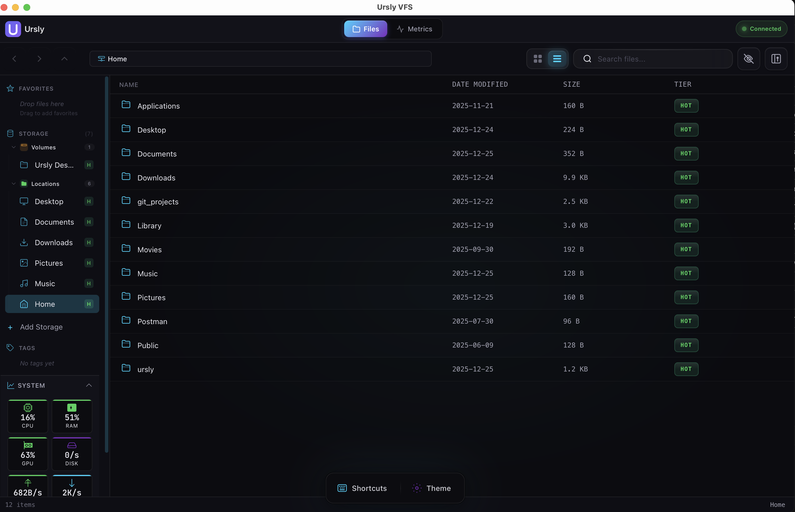
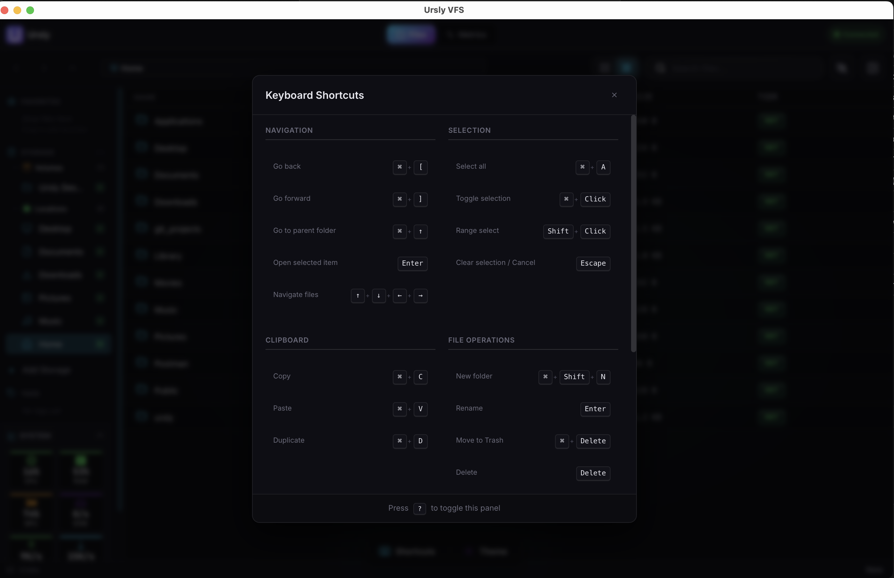
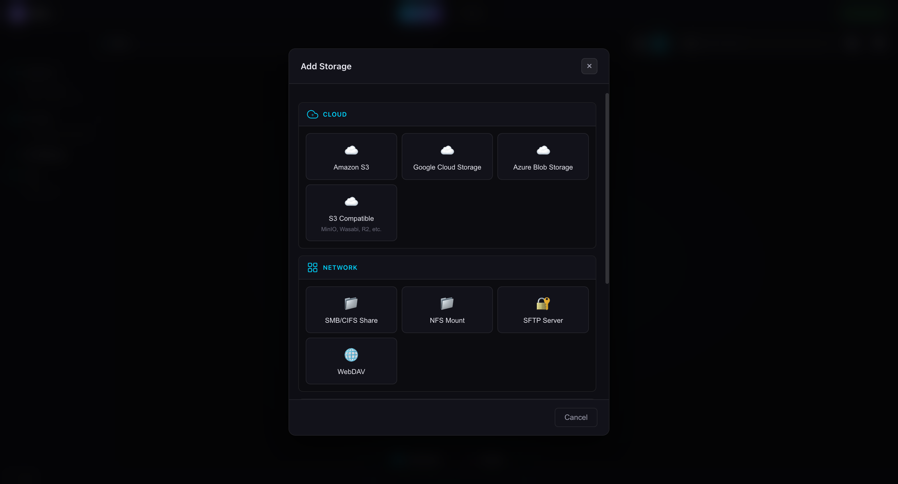

<div align="center">


# Ursly VFS

### The File Manager Built for Creatives

**One app. All your clouds. Zero friction.**

✅ **Enterprise-Grade**: Production-ready desktop application with native performance, comprehensive testing, and enterprise-quality code.

Connect AWS, Azure, Google Cloud, your NAS, and 15+ more storage services. Search with AI. Stay in flow.

<br />


<br />
<br />

[](https://github.com/stonyp90/Ursly/actions/workflows/ci.yml)
[](https://github.com/stonyp90/Ursly/actions/workflows/release.yml)
[](https://github.com/stonyp90/Ursly/actions)
[](https://github.com/stonyp90/Ursly)
[](https://github.com/stonyp90/Ursly/releases/latest)
[](https://www.gnu.org/licenses/agpl-3.0)
[](https://github.com/stonyp90/Ursly/stargazers)
[](https://www.typescriptlang.org/)
[](https://react.dev/)
[](https://tauri.app/)
[](https://www.rust-lang.org/)

<br />

[**Download**](https://github.com/stonyp90/Ursly/releases/latest) · [Website](https://ursly.io) · [Report Bug](https://github.com/stonyp90/Ursly/issues/new) · [Request Feature](https://github.com/stonyp90/Ursly/issues/new)

</div>

---

## 🚀 Why Ursly VFS?

Your files are scattered across AWS S3, Azure Blob, Google Cloud, your NAS, local drives, and Dropbox. Each requires a different app. You waste hours hunting for files.

**Ursly VFS changes everything.** One beautiful, native app that unifies all your storage. See everything in one place. Move files anywhere with drag & drop. Find anything instantly with AI-powered search that runs 100% locally.

---

## ✨ Key Features

### 🔗 Multi-Cloud Unified Storage

Connect **15+ storage providers** in one unified interface:

- **Cloud**: AWS S3, Google Cloud Storage, Azure Blob, S3-Compatible (MinIO, Wasabi, R2)
- **Network**: SMB/CIFS, NFS, SFTP, WebDAV
- **Hybrid**: FSx for ONTAP, NetApp
- **Block**: iSCSI, Fibre Channel

### 🔍 Spotlight Search (`Cmd+K` / `Ctrl+K`)

- **Instant Search**: Find files across all storage instantly
- **Smart Operators**: `tag:`, `type:`, `ext:`, `size:` filters
- **AI-Powered**: Content-aware search with local Ollama integration
- **Keyboard-First**: Full keyboard navigation and shortcuts

### 🎬 Video & Media Intelligence

- **Video Transcription**: Auto-transcribe videos in 99 languages with Whisper
- **Smart Thumbnails**: Auto-generated thumbnails for photos and videos
- **HLS Streaming**: Stream videos from any storage tier
- **Media Preview**: Built-in preview for images, videos, PDFs

### 🏷️ Smart Tagging & Organization

- **AI Auto-Tagging**: Automatically tag photos and images
- **Cross-Storage Tags**: Tags sync across all storage providers
- **Color-Coded**: Visual organization with color-coded tags
- **Favorites**: Quick access to frequently used locations

### 📊 Real-Time System Monitoring

- **GPU Metrics**: Temperature, power, fan speed, core clock
- **CPU & Memory**: Per-core usage, load averages, RAM utilization
- **Disk I/O**: Read/write speeds and throughput
- **Network**: Upload/download speeds and bandwidth

### ⌨️ Keyboard-First Design

Every action has a shortcut:

- `⌘+K` / `Ctrl+K` - Spotlight Search
- `⌘+A` - Select All
- `⌘+C/V` - Copy/Paste
- `⌘+Shift+N` - New Folder
- `Enter` - Rename
- `Delete` - Move to Trash
- `?` - Show all shortcuts

### 🎨 Theme Customization & Settings

Customize your experience with a dedicated Settings tab:

- **Dark & Light Themes**: Switch between themes instantly
- **10 Accent Colors**: Choose from Cyan, Purple, Neon Cyan, Electric Purple, and more
- **Onboarding Tour**: Interactive tour to learn features and shortcuts
- **Auto-Updates**: Seamless updates with progress tracking
- **Settings Tab**: Access all preferences from the header navigation

### 🎯 Three Deployment Modes

- **Cloud GPU**: Windows Server 2025 with FSx ONTAP + NVMe cache
- **Workstation**: Local machine with LucidLink sync
- **Browser-Only**: API-based access without local mounts

### 🔒 Privacy & Security

- **100% Local AI**: All AI processing runs locally with Ollama
- **Zero Cloud Dependencies**: Your files never leave your machine
- **Secure Connections**: Encrypted connections to all storage providers
- **No Telemetry**: No tracking, no analytics, no data collection

---

## 📸 Screenshots

<div align="center">

### Main File Browser


### Performance Monitor



### Keyboard Shortcuts



### Settings & Theme Customization


### Add Storage Modal



</div>

---

## 📥 Download

**Free for personal use. No account required. No credit card.**

<div style="overflow-x: auto;">

| Platform    | Download                                                                                            | Requirements  |
| ----------- | --------------------------------------------------------------------------------------------------- | ------------- |
| **macOS**   | [Download .dmg](https://github.com/stonyp90/Ursly/releases/latest/download/ursly-vfs.dmg)           | macOS 11+     |
| **Windows** | [Download .msi](https://github.com/stonyp90/Ursly/releases/latest/download/ursly-vfs.msi)           | Windows 10/11 |
| **Linux**   | [Download .AppImage](https://github.com/stonyp90/Ursly/releases/latest/download/ursly-vfs.AppImage) | glibc 2.31+   |

</div>

> **macOS:** If you see "App is damaged", run: `xattr -cr /Applications/Ursly\ VFS.app`

---

## 🛠️ Built With Modern Tech

<div style="overflow-x: auto;">

| Layer            | Technology                   | Purpose                          |
| ---------------- | ---------------------------- | -------------------------------- |
| **Desktop App**  | Tauri 2.0 + Rust             | Native performance, small bundle |
| **Frontend**     | React 18 + TypeScript        | Modern UI framework              |
| **Styling**      | Tailwind CSS + CSS Variables | Consistent theming               |
| **Local AI**     | Ollama + Whisper             | Privacy-first AI processing      |
| **Build System** | Nx Monorepo                  | Efficient builds and testing     |
| **Icons**        | Lucide React                 | Beautiful icon library           |

</div>

---

## 🚦 Quick Start

### Prerequisites

- **Node.js**: 24.x or later
- **npm**: 10.x or later
- **Rust**: 1.70+ (for Tauri)
- **Platform Tools**:
  - **macOS**: Xcode Command Line Tools
  - **Windows**: Visual Studio Build Tools
  - **Linux**: `libwebkit2gtk-4.0-dev`, `libssl-dev`

### Installation

```bash
# Clone the repository
git clone https://github.com/stonyp90/Ursly.git
cd Ursly

# Install dependencies
npm install

# Run the desktop app in development mode
cd apps/vfs-desktop
npm run tauri:dev
```

### Building for Production

```bash
# Build for current platform
npm run build:vfs

# Or use Tauri CLI directly
cd apps/vfs-desktop
npm run tauri:build
```

---

## 🏗️ Architecture

### Clean Architecture (Ports & Adapters)

Ursly VFS follows Clean Architecture principles:

```
┌─────────────────────────────────────────────────────────────┐
│                      VFS Module                              │
├─────────────────────────────────────────────────────────────┤
│  ┌─────────────┐   ┌─────────────┐   ┌─────────────┐        │
│  │   Domain    │   │    Ports    │   │  Adapters   │        │
│  │  entities   │   │  (traits)   │   │ (concrete)  │        │
│  │  values     │   │ IStorage    │   │ S3Adapter   │        │
│  │  events     │   │ ICache      │   │ LocalAdapter│        │
│  └─────────────┘   └─────────────┘   └─────────────┘        │
│           │               ▲                 │                │
│           └───────────────┼─────────────────┘                │
│                           │                                  │
│                  ┌────────┴────────┐                         │
│                  │   Application   │                         │
│                  │   (use cases)   │                         │
│                  └─────────────────┘                         │
└─────────────────────────────────────────────────────────────┘
```

### Storage Tiers

| Tier         | Provider              | Retrieval Time   | Metadata     | Cost     |
| ------------ | --------------------- | ---------------- | ------------ | -------- |
| **Hot**      | FSx ONTAP             | Instant (sub-ms) | Full         | $$$$$    |
| **Nearline** | FSxN S3 (Fabric Pool) | 1-5 seconds      | Full (local) | $$       |
| **Cold**     | S3 Glacier Instant    | Instant          | Full (API)   | $        |
| **Archive**  | S3 Glacier Deep       | 12-48 hours      | Full (API)   | Cheapest |

---

## 🧪 Development

### Available Scripts

```bash
# Development
npm run start:vfs        # Start VFS desktop app
npm run build:vfs        # Build for production

# Testing
npm test                 # Run all tests
npm run test:watch       # Watch mode
npm run test:coverage    # Coverage report

# Code Quality
npm run lint             # Lint code
npm run lint:fix         # Fix linting issues
```

### Project Structure

```
ursly/
├── apps/
│   └── vfs-desktop/     # Tauri desktop application
│       ├── src/         # React frontend
│       └── src-tauri/   # Rust backend
├── website/             # Marketing website
└── package.json         # Root package configuration
```

---

## 📚 Documentation

- **[Architecture Guide](./vfs.md)**: Detailed architecture documentation
- **[API Documentation](./docs/api.md)**: API reference (coming soon)
- **[Contributing Guide](./CONTRIBUTING.md)**: How to contribute (coming soon)

---

## 🤝 Contributing

We welcome contributions! Here's how you can help:

1. **Fork the repository**
2. **Create a feature branch**: `git checkout -b feature/amazing-feature`
3. **Make your changes** with tests
4. **Run tests**: `npm test && npm run lint`
5. **Commit**: `git commit -m 'feat: add amazing feature'`
6. **Push**: `git push origin feature/amazing-feature`
7. **Open a Pull Request**

### Development Guidelines

- Follow the existing code style
- Write tests for new features
- Update documentation as needed
- Use conventional commits
- Ensure all tests pass before submitting

---

## 📄 License

**AGPL-3.0** — Free for personal use. [View license](LICENSE)

### License Summary

- ✅ **Commercial Use**: Allowed
- ✅ **Modification**: Allowed
- ✅ **Distribution**: Allowed
- ✅ **Private Use**: Allowed
- ❌ **Sublicensing**: Not allowed
- ❌ **Liability**: No warranty provided

**Note**: AGPL-3.0 requires that if you modify and run this software, you must make the source code available to users who interact with it over a network.

---

## 🆘 Support

- **Website**: [ursly.io](https://ursly.io)
- **GitHub**: [github.com/stonyp90/Ursly](https://github.com/stonyp90/Ursly)
- **Issues**: [Report a bug](https://github.com/stonyp90/Ursly/issues/new)
- **Discussions**: [GitHub Discussions](https://github.com/stonyp90/Ursly/discussions)

---

## 🙏 Acknowledgments

Built with inspiration from:

- **[rclone](https://github.com/rclone/rclone)** - Command-line program to sync files
- **[Mountain Duck](https://mountainduck.io/)** - Mount cloud storage as local drives
- **[Tauri](https://github.com/tauri-apps/tauri)** - Build smaller, faster desktop apps
- **[OpenDAL](https://github.com/apache/opendal)** - Universal data access layer

---

<div align="center">

**[ursly.io](https://ursly.io)** · [Download](https://github.com/stonyp90/Ursly/releases/latest) · [GitHub](https://github.com/stonyp90/Ursly)

<br />

Created by **[Anthony Paquet](https://www.linkedin.com/in/anthony-paquet-94a31085/)**

<br />

⭐ **Star us on GitHub** — it helps others discover Ursly!

</div>
